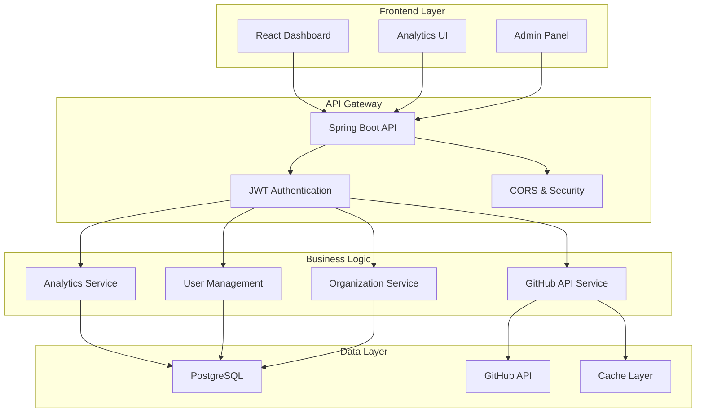
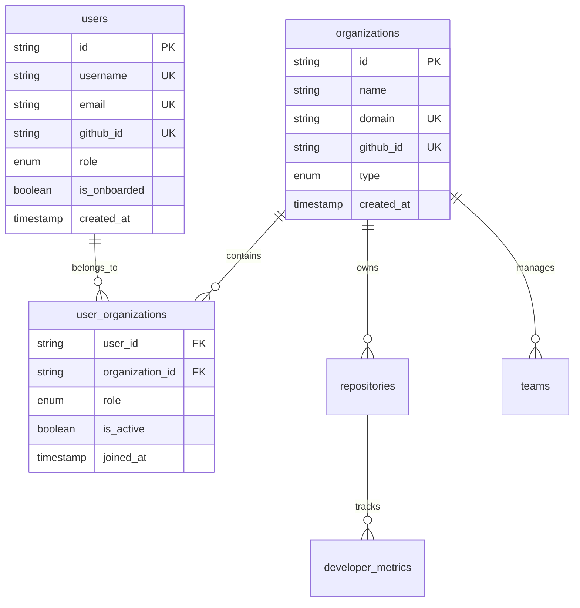
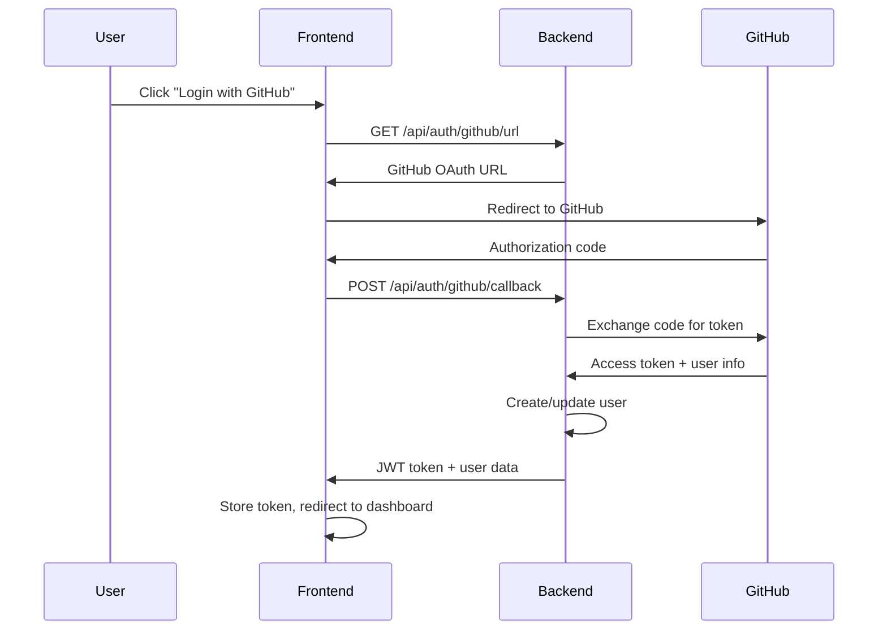
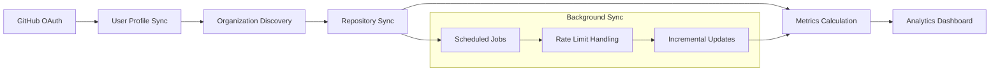
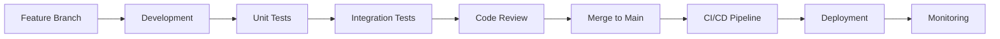
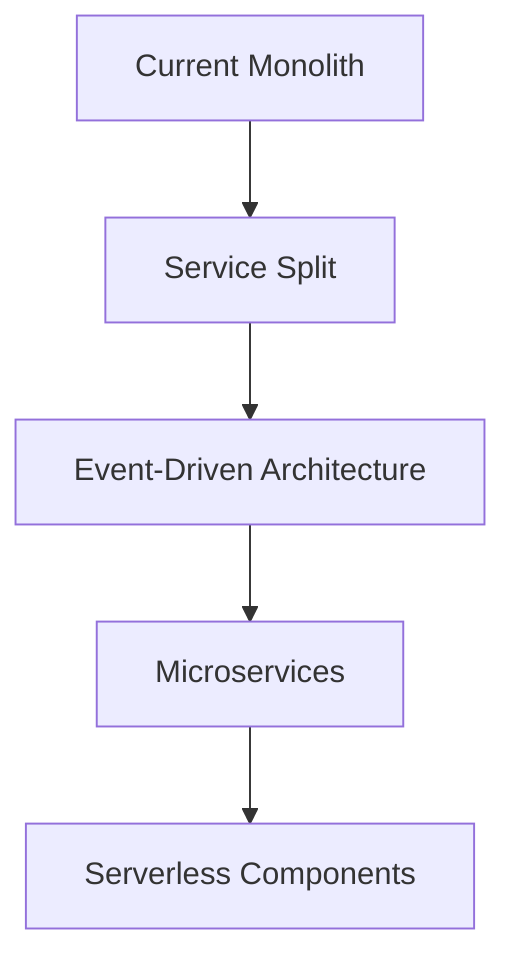

# 🏗️ ReportFlow System Architecture

## 📋 Overview

ReportFlow is a **multi-tenant GitHub analytics platform** designed to provide insights into developer productivity, team performance, and repository metrics through comprehensive dashboards and reports.

### 🎯 Business Objectives
- **Developer Productivity**: Track individual and team performance metrics
- **Management Insights**: Provide actionable analytics for project management
- **Organizational Analytics**: Multi-repository, cross-team visibility
- **Cost Optimization**: Reduce overhead compared to enterprise alternatives

---

## 🏛️ High-Level Architecture



---

## 🎨 Frontend Architecture

### **Technology Stack**
- **Framework**: React 18 with TypeScript
- **State Management**: TanStack Query + React Context
- **UI Components**: Radix UI + Tailwind CSS
- **Charts**: Recharts for data visualization
- **Routing**: Wouter (lightweight alternative)
- **Build Tool**: Vite

### **Component Architecture**
```
src/
├── components/
│   ├── ui/              # Radix UI primitives
│   ├── dashboard/       # Analytics components
│   ├── layout/          # App shell, navigation
│   └── shared/          # Reusable components
├── pages/               # Route components
├── hooks/               # Custom React hooks
├── lib/                 # Utilities, API clients
└── shared/              # Database schemas (Drizzle)
```

### **State Management Strategy**
```typescript
// Authentication Context
AuthProvider → useAuth() → User state & JWT tokens

// Tenant Management  
TenantProvider → useTenant() → Organization switching

// Server State
TanStack Query → API caching & synchronization

// Local State
useState/useReducer → UI interactions & forms
```

---

## 🚀 Backend Architecture

### **Technology Stack**
- **Framework**: Spring Boot 3.2.0 with Java 17
- **Database**: PostgreSQL with JPA/Hibernate
- **Security**: Spring Security + JWT + GitHub OAuth
- **API Client**: GitHub API integration
- **Build**: Maven with Lombok

### **Layered Architecture**

#### **1. Presentation Layer (Controllers)**
```java
@RestController
@RequestMapping("/api/{module}")
public class ModuleController {
    // REST API endpoints
    // Request/Response handling
    // Validation & Error handling
}
```

#### **2. Business Logic Layer (Services)**
```java
@Service
@RequiredArgsConstructor
public class ModuleService {
    // Business rules implementation
    // Data transformation
    // External API integration
}
```

#### **3. Data Access Layer (Repositories)**
```java
@Repository
public interface ModuleRepository extends JpaRepository<Entity, ID> {
    // Custom queries with JPQL
    // Database operations
    // Data mapping
}
```

#### **4. Domain Model Layer (Entities)**
```java
@Entity
@Table(name = "table_name")
@Data
@NoArgsConstructor
@AllArgsConstructor
public class Entity {
    // JPA annotations
    // Business rules
    // Relationships
}
```

---

## 🗄️ Database Architecture

### **Multi-Tenant Design**
```sql
-- Core Entities
users                    -- User profiles with GitHub integration
organizations            -- Multi-tenant organizations
user_organizations       -- Many-to-many with roles

-- GitHub Integration
repositories             -- Repository tracking with sync status
teams                   -- Team management within orgs
developer_metrics       -- Individual performance analytics
```

### **Entity Relationships**


---

## 🔐 Security Architecture

### **Authentication Flow**


### **Authorization Model**
```yaml
Role-Based Access Control (RBAC):
  ADMIN:
    - Organization management
    - User management
    - System configuration
    - All analytics access
  
  MANAGER:
    - Team management
    - Repository management
    - Team analytics
    - Performance reports
  
  DEVELOPER:
    - Personal analytics
    - Repository access
    - Team visibility
    - Profile management
```

### **Security Layers**
1. **Network Security**: CORS configuration, HTTPS enforcement
2. **Authentication**: JWT tokens with expiration claims
3. **Authorization**: Role-based endpoint access
4. **Data Security**: Input validation, SQL injection prevention
5. **API Security**: Rate limiting, request validation

---

## 🔄 Data Flow Architecture

### **GitHub Integration Pipeline**


### **Analytics Pipeline**
```
Raw GitHub Data
    ↓
Repository Metrics (commits, PRs, issues)
    ↓
Developer Performance (contributions, reviews)
    ↓
Team Analytics (velocity, collaboration)
    ↓
Business Intelligence (KPIs, trends, insights)
```

---

## 🌐 API Architecture

### **RESTful Design Principles**
```yaml
Base URL: https://api.reportflow.com/api/v1

Authentication: Bearer JWT
Content-Type: application/json
Rate Limiting: 1000 requests/hour

Resources:
  /auth/*           - Authentication endpoints
  /users/*          - User management
  /organizations/*  - Organization management
  /repositories/*   - Repository operations
  /analytics/*      - Analytics & reporting
  /teams/*          - Team management
```

### **API Response Standards**
```json
{
  "success": true,
  "data": { ... },
  "message": "Operation completed successfully",
  "timestamp": "2025-01-15T10:30:00Z",
  "requestId": "req_123456789"
}
```

### **Error Handling**
```json
{
  "success": false,
  "error": {
    "code": "VALIDATION_ERROR",
    "message": "Invalid input parameters",
    "details": {
      "field": "email",
      "issue": "Invalid email format"
    }
  },
  "timestamp": "2025-01-15T10:30:00Z",
  "requestId": "req_123456789"
}
```

---

## 📊 Analytics Architecture

### **KPI Calculation Engine**
```java
@Service
public class AnalyticsService {
    // Real-time KPI calculations
    // Trend analysis algorithms
    // Performance benchmarking
    // Predictive analytics
}
```

### **Chart Data Generation**
```typescript
// Chart Data Structure
interface ChartData {
  label: string;
  value: number;
  trend: 'up' | 'down' | 'stable';
  color: string;
  metadata?: Record<string, any>;
}
```

### **Supported Analytics Types**
- **Time Series**: Commits, PRs, issues over time
- **Comparative**: Team vs team performance
- **Distribution**: Code review patterns, contribution spread
- **Predictive**: Velocity forecasting, capacity planning

---

## 🚀 Deployment Architecture

### **Production Environment**
```yaml
Frontend:
  - Platform: Vercel/Netlify
  - CDN: Global edge distribution
  - Build: Optimized React bundles
  - Security: HTTPS, CSP headers

Backend:
  - Platform: Render.com/DigitalOcean
  - Container: Docker with multi-stage builds
  - Database: Managed PostgreSQL
  - Monitoring: Application & infrastructure metrics

Infrastructure:
  - CI/CD: GitHub Actions
  - Monitoring: Uptime + performance
  - Backup: Automated database backups
  - Security: SSL certificates, firewalls
```

### **Scalability Considerations**
```yaml
Horizontal Scaling:
  - Load balancer for API instances
  - Database read replicas
  - Redis caching layer
  - CDN for static assets

Vertical Scaling:
  - Auto-scaling based on load
  - Resource optimization
  - Memory management
  - CPU utilization monitoring
```

---

## 🔧 Development Architecture

### **Code Organization**
```
ReportFlow/
├── docs/                    # Documentation hub
├── report_backend/          # Spring Boot API
│   ├── src/main/java/
│   │   └── com/reportflow/
│   │       ├── controller/  # REST endpoints
│   │       ├── service/     # Business logic
│   │       ├── repository/  # Data access
│   │       ├── entity/      # Domain models
│   │       ├── dto/         # Data transfer objects
│   │       ├── security/    # Authentication/authorization
│   │       └── config/      # Configuration
│   └── src/main/resources/
│       └── application.properties
└── report_frontend/         # React application
    ├── client/src/
    │   ├── components/      # UI components
    │   ├── pages/           # Route components
    │   ├── hooks/           # Custom hooks
    │   ├── lib/             # Utilities
    │   └── shared/          # Shared schemas
    └── server/              # Express server (if needed)
```

### **Development Workflow**


---

## 📈 Performance Architecture

### **Frontend Optimization**
```typescript
// Code Splitting
const Dashboard = lazy(() => import('./pages/dashboard'));

// Image Optimization
const optimizedImage = {
  src: imageUrl,
  sizes: '(max-width: 768px) 100vw, 50vw',
  loading: 'lazy'
};

// Bundle Optimization
// - Tree shaking
// - Dynamic imports
// - Service worker caching
```

### **Backend Optimization**
```java
// Database Optimization
@Entity
@Table(indexes = {
  @Index(name = "idx_user_github_id", columnList = "githubId"),
  @Index(name = "idx_org_name", columnList = "name")
})
public class User {
  // Optimized entity design
}

// Caching Strategy
@Cacheable(value = "organizations", key = "#userId")
public List<Organization> getUserOrganizations(String userId) {
  // Cached organization data
}
```

---

## 🔍 Monitoring & Observability

### **Application Monitoring**
```yaml
Metrics:
  - Response times
  - Error rates
  - Database performance
  - GitHub API rate limits
  - User engagement

Logging:
  - Structured JSON logs
  - Correlation IDs
  - Error tracking
  - Performance profiling

Alerting:
  - Service downtime
  - Performance degradation
  - Security incidents
  - Resource utilization
```

### **Health Checks**
```java
@Component
public class HealthIndicator implements HealthIndicator {
    @Override
    public Health health() {
        // Database connectivity
        // GitHub API availability
        // Cache status
        // External dependencies
    }
}
```

---

## 🛡️ Security Best Practices

### **Threat Mitigation**
```yaml
OWASP Top 10 Coverage:
  - Injection: Parameterized queries, input validation
  - Authentication: JWT with expiration, secure storage
  - Authorization: Role-based access control
  - Configuration: Environment variables, secrets management
  - Dependencies: Regular security updates, vulnerability scanning
```

### **Data Protection**
```java
// Sensitive Data Handling
@JsonIgnore
private String githubAccessToken;

// Input Validation
@NotBlank
@Email
private String email;

// SQL Injection Prevention
@Query("SELECT u FROM User u WHERE u.githubId = :githubId")
User findByGithubId(@Param("githubId") String githubId);
```

---

## 🚀 Future Architecture Evolution

### **Planned Enhancements**
```yaml
Microservices Migration:
  - Analytics Service (separate)
  - GitHub Integration Service
  - Notification Service
  - Report Generation Service

Advanced Features:
  - Machine Learning for predictions
  - Real-time WebSocket updates
  - Advanced caching strategies
  - Multi-region deployment

Integrations:
  - Jira/Asana project management
  - Slack/Discord notifications
  - CI/CD pipeline analytics
  - Custom metric calculations
```

### **Scalability Roadmap**


---

## 📚 Documentation Standards

### **Architecture Documentation**
- **System Overview**: High-level architecture diagrams
- **Component Details**: Individual component specifications
- **Data Models**: Entity relationships and schemas
- **API Documentation**: Complete endpoint specifications
- **Deployment Guides**: Environment setup and configuration

### **Maintenance Schedule**
```yaml
Quarterly:
  - Architecture review
  - Performance optimization
  - Security assessment
  - Documentation updates

Monthly:
  - Dependency updates
  - Performance monitoring
  - User feedback analysis
  - Feature planning

Weekly:
  - Code quality checks
  - Test coverage review
  - Security scanning
  - Documentation maintenance
```

---

## 🎯 Success Metrics

### **Technical KPIs**
```yaml
Performance:
  - API response time < 200ms
  - Frontend load time < 3s
  - 99.9% uptime SLA
  - Database query optimization

Quality:
  - 90%+ test coverage
  - Zero critical security vulnerabilities
  - Code quality score > 8.0
  - Documentation completeness > 95%

Scalability:
  - Support 10,000+ concurrent users
  - Handle 1M+ API requests/day
  - Horizontal scaling capability
  - Multi-region deployment ready
```

### **Business KPIs**
```yaml
User Experience:
  - User onboarding time < 5 minutes
  - Dashboard load time < 2 seconds
  - Feature adoption rate > 80%
  - User satisfaction score > 4.5/5

Operational:
  - Support ticket resolution < 24 hours
  - System maintenance downtime < 1 hour/month
  - Feature delivery cycle < 2 weeks
  - Customer retention rate > 95%
```

---

## 📞 Support & Governance

### **Documentation Ownership**
```yaml
Architecture Team:
  - System design decisions
  - Technology stack evaluation
  - Performance optimization
  - Security architecture

Development Team:
  - Component documentation
  - API specifications
  - Code examples
  - Testing strategies

Operations Team:
  - Deployment guides
  - Monitoring procedures
  - Incident response
  - Backup procedures
```

### **Change Management**
```yaml
Architecture Changes:
  - ADR (Architecture Decision Records)
  - Impact assessment
  - Stakeholder approval
  - Implementation timeline

Documentation Updates:
  - Version control tracking
  - Review process
  - Publication workflow
  - Archive management
```

---

*This architecture document serves as the single source of truth for ReportFlow system design and evolution. All architectural decisions should reference this document and be updated here when changes are made.*
